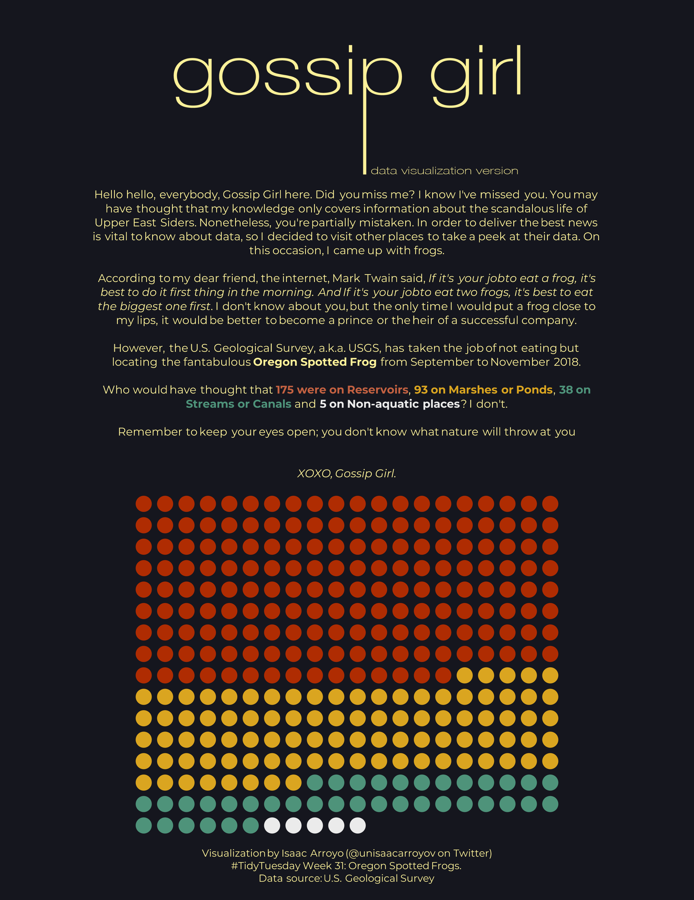
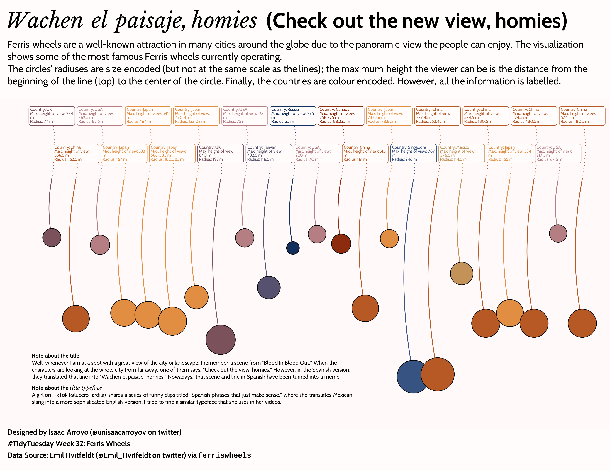
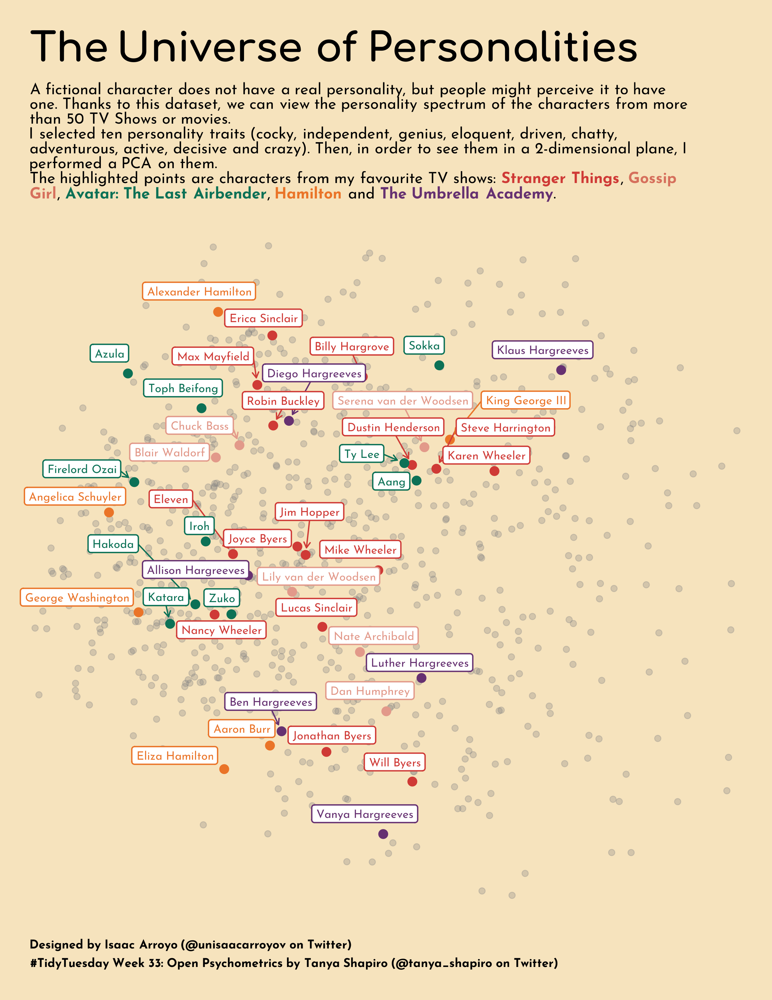
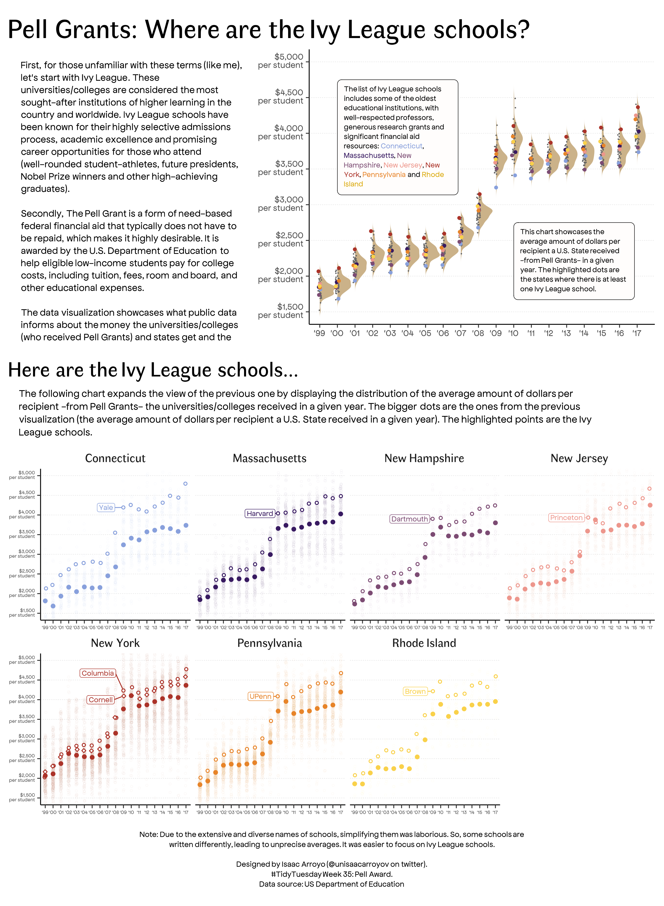

# Tidy Tuesday 🖌️ 💻
Contributions to the #TidyTuesday challenge created by [@R4DScommunity](https://twitter.com/R4DScommunity)
## 2022 Gallery
### Week 27: San Francisco Rents 🏘️ 🌉 💰
[**Code**](https://github.com/isaacarroyov/tidy_tuesday_R/blob/main/scripts_2022/2022_week-27_san-francisco-rents.R)

### Week 28: European Flights 🛩️ 🌍
[**Code**](https://github.com/isaacarroyov/tidy_tuesday_R/blob/main/scripts_2022/2022_week-28_european-flights.R)

### Week 29: Technology Adoption
[**Code**](https://github.com/isaacarroyov/tidy_tuesday_R/blob/main/scripts_2022/2022_week-29_technology-adoption.R)

### Week 30: Bring Your Own Data (BYOD) ➡️ Undergrad thesis data: Hotspots in Yucatan, Mexico.
[**Code**](https://github.com/isaacarroyov/tidy_tuesday_R/blob/main/scripts_2022/2022_week-30_byod.R)

### Wek 31: Oregon Spotted Frog 🐸

[**Code**](https://github.com/isaacarroyov/tidy_tuesday_R/blob/main/scripts_2022/2022_week-31_frogs.R)

### Week 32: Ferris Wheels `{ferriswheels}`

[**Code**](https://github.com/isaacarroyov/tidy_tuesday_R/blob/main/scripts_2022/2022_week-32_ferris-wheels.R)

### Week 33: Open Psychometrics by [Tanya Shapiro](https://twitter.com/tanya_shapiro)

[**Code**](https://github.com/isaacarroyov/tidy_tuesday_R/blob/main/scripts_2022/2022_week-33_open-psychometrics.R)

### Week 34: CHIP dataset
[**Code**](https://github.com/isaacarroyov/tidy_tuesday_R/blob/main/scripts_2022/2022_week-34_chips.R)

### Week 35: Pell Award
[**Code**](https://github.com/isaacarroyov/tidy_tuesday_R/blob/main/scripts_2022/2022_week-35_pell-award.R)

### Week 36: LEGO
[**Code**](https://github.com/isaacarroyov/tidy_tuesday_R/blob/main/scripts_2022/2022_week-36_lego.R)

### Week 37: Big Foot
[**Code**](https://github.com/isaacarroyov/tidy_tuesday_R/blob/main/scripts_2022/2022_week-37_bigfoot.R)

### Week 38: Hydro Wastewater plants
[**Code**](https://github.com/isaacarroyov/tidy_tuesday_R/blob/main/scripts_2022/2022_week-38_wastewater-plants.R)  
**Data Visualization in English and Español**
